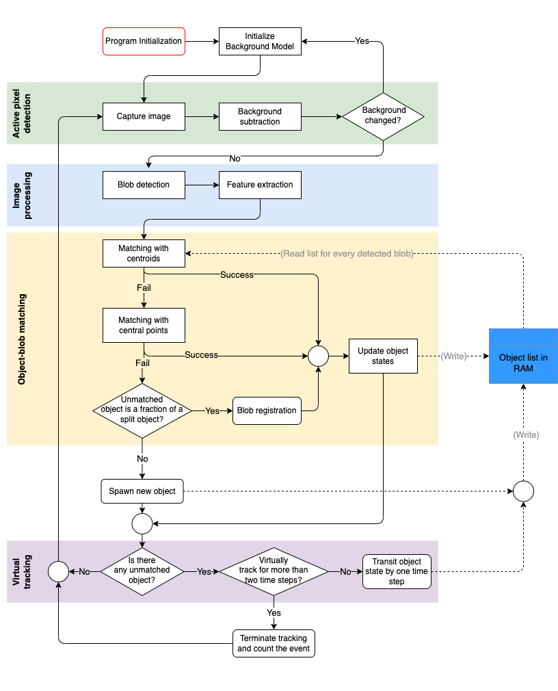

# Arducam Room Tracking

## Overview

This is the source code of a occupancy tracking system. This repository is designed for use in conjunction with an ESP32-WROVER development board, and an Arducam Mini 2MP Plus using an OV2640 SPI Camera Module.

The ViBe algorithm for background subtraction is used to first detect foreground objects and generate a segmentation map. The segmentation map is passed to an object tracking algorithm developed by Chenyuan Zhao, which is responsible for classifying the occurrence of entry and exit events. This information is used to determine the number of occupants in a given area using a relative counting method.

Occupancy status information can be accessed in real time using a Node-Red dashboard. The Node-Red flows can be imported using the JSON files stored in the "nodered" directory. Occupancy count history is sent to the CAPS IoT Platform based on ElasticSearch and Kibana, which was developed by TUM researchers. This platform stores the history in a database for analsysis.

Additionally, debugging and video simulation can be conducted with the use of Node-Red. Locally-stored image frames can be sent via MQTT and received by the ESP32, which passes the frame as input to the occupancy tracking algorithm.

## Running the Code

Using ESP-IDF, navigate to `./main` and run the command `idf.py -p <port_name> build flash monitor` to compile and flash the code to an ESP32 development board.

### Hardware Setup
There are two components connected to the ESP32: a button that resets the occupancy count and the Arducam Mini 2MP Plus. The Arducam Mini 2MP Plus is connected to the pins on the development board as follows:

| Arducam Mini 2MP Plus     | ESP32  |
| --------------- | -------- | 
| CS		| 5	|
| MOSI	| 23	|
| MISO	| 19	|
| SCK	| 18	|
| GND	| GND |
| VCC	| 5V	|
| SDA	| 21	|
| SCL	| 22	|

The button is connected to 3V3 and GPIO pin 4 on the ESP32.

### Software Setup
1. Network Configuration: The device requires a Wi-Fi connection to send occupancy status information via MQTT to the data visualization and storage platforms. Under `main`, go to `macro.h` and configure the Wi-Fi SSID, password, and MQTT URI.

2. Configuration of SNTP Server: The timestamp of an event is used when sending occupancy status information. This is obtained using the SNTP protocol, and the corresponding SNTP server that is available from the home network should be selected.

3. MQTT Broker and Client: These are necessary for messages to be transmitted and received. Using the Node-Red flows provided in this repository is sufficient. Alternatively, another MQTT broker and client may be used with the following topics:
   | Topic         | Description                                                  |
   | -------------- | ------------------------------------------------------------ |
   | ovcount  | Final count value accumulated by every relative count  |
   | ovSavePic  | When image storage functionality is enabled, image frames captured by the Arducam are sent to Node-Red with this topic and saved in a local .txt file |
   | ov2640/base64 | When debugging is enabled, the image frames are sent to Node-Red with this topic for visualization |
   | ov2640/segmap | When debugging is enabled, the segmentation maps generated are sent to Node-Red with this topic for visualization |
   
   4. Node-Red: Enables visualiation of data sent through MQTT. Setup Node-Red and import the .json file found in `nodered`. The MQTT broker should be configured for all MQTT client nodes. Additionally, the [dashboard](https://flows.nodered.org/node/node-red-dashboard) and [image-tools](https://flows.nodered.org/node/node-red-contrib-image-tools) libraries need to be downloaded. `Room-Monitor-Dashboard.json` imports the flow used for the dashboard, and `Simulation.json` imports the flow used in debugging to send image frames to the ESP32.
   
### Debugging
Image sequences can be be sent from local storage to the ESP32 via MQTT to simulate real-time use of the occupancy tracking system. This allows the user to analyze intermediate results with ease and adjust code parameters if necessary.

Image frames are stored as individual .txt files in csv format. Each pixel is represented as three integer values (ranging from 0 to 255), similar to the RGB888 format. The Node-Red flow `Simulation.json`parses the .txt file and converts the data to binary before sending it to the ESP32.

The simulation task should be enabled in `main.cpp` instead of the image capture task. This can be done by uncommenting lines 446 and 447, and commenting lines 450 - 463. Additionally, helpful print functions that output debug information to the console can be enabled by defining `DEBUG` as 1 in `macro.h`.

## Algorithm
Traditional computer vision methods are applied to process the images obtained and determine occupancy count. The algorithm achieves this in three steps: blob detection, feature extraction, and object tracking.

### Blob Detection
The Arducam camera module captures image frames and transmits these to the ESP32. The ViBe algorithm for background subtraction (designed by Barnich et al.) is used to identify foreground objects. Erosion and dilation is applied to remove noise and reconnect falsely separated blobs. At the end of this step, a segmentation map containing the binary blob mask is obtained.

### Feature Extraction
The binary blob mask is used to abstract the detected blobs by identifying three features: their centroid, size, and central points. This is then stored in a blob list for object matching.

### Object Tracking
Objects are identified based on the blob list obtained in the feature extraction step. A list of objects is maintained by the algorithm, which is used in conjunction with the blob list to track the trajectory of moving objects. A threshold is applied to determine the occurrence of of entry and exit events.

The complete algorithm functions as follows:

## Code
The source code in this repository is structured as follows:

| folder       | content                            |
| ------------ | ---------------------------------- |
| ./main       | the main function                  |
| ./lib        | C functions (includes external libraries used) |
| ./include    | header files for C functions    |
| ./cpplib     | CPP functions                      |
| ./cppinclude | header files for CPP functions |

The main function and tracking functions are implemented in CPP, as using modelling objects as classes in CPP greatly simplifies program design. The object detection and feature extraction functions are implemented in C.

### Key Functions

The following source files are used for **object detection**:

* header file
  * detect.h
  * grideye_api_common.h
  * libmorpho.h
  * vibe-background-sequential.h
* C file
  * detect_api.c
  * detect_functions.c
  * erosionByAnchor.c
  * vibe-background-sequential.c
  
`vibe-background-sequential.c` contains the original implementation of the ViBe background subtraction algorithm used for blob detection. `detect_api.c` contains the implemented image dilation function, and a set of wrapper functions that can be used to call the blob labelling and helper functions implemented in `detect_functions.c`. `erosionByAnchor.c` contains the original library used for image erosion.

The following source files are used for **feature extraction**:

*  header file
  * feature_extraction.h
* C file 
  * feature_extraction.c

`feature_extraction.c` implements the functions used for abstracting blobs that were identified in the object detection step. A "Blob" structure is defined in the header file and contains information on the centroid, central points, and size of the blob. At the end of the feature extraction step, a list of aggregated blob information is returned in an array of Blobs.

As the **tracking** functions require dynamic memory management, CPP is used in their implementation:

* header file
  * human_object.hpp
  * tracking.hpp
* CPP file
  * human_object.cpp
  * tracking.cpp

`human_object.cpp` defines a class that represents a human object. Functions used to handle the generation, update, and deletion of a human object are implemented here. The matching algorithm is implemented in `tracking.cpp`, which maintains a list of human objects and tracks the trajectory of detected humans.

While the remaining files are not directly relevant to the algorithm, they contain necessary components of this project:

| file                                                     | utility                                                      |
| -------------------------------------------------------- | ------------------------------------------------------------ |
| network_common.h network_wifi.c network_mqtt.c | Manages Wi-Fi connection and publshing of MQTT messages                       |
| sntp_controller.h sntp_controller.c                 | SNTP client used to obtain the current timestamp         |
| libattopng.h libattopng.c                                     | Library used to visualize image frames in PNG format |
| helper.h helper.c                                   | Print functions used for debugging                     |
